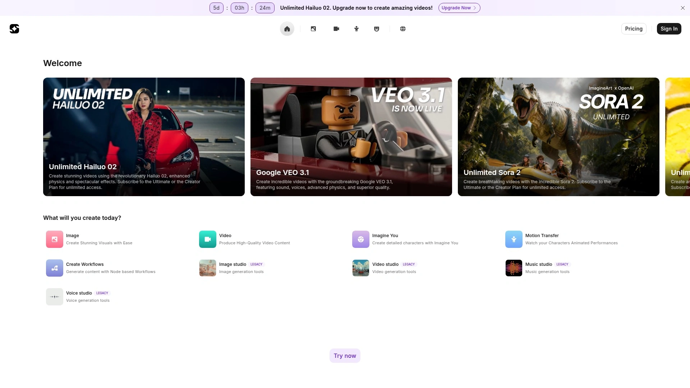
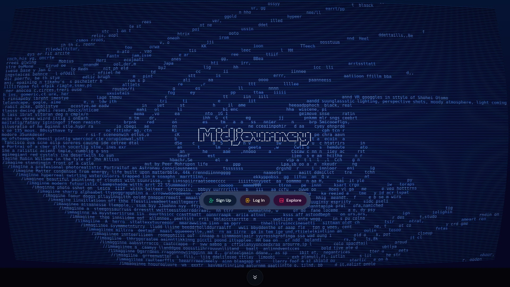
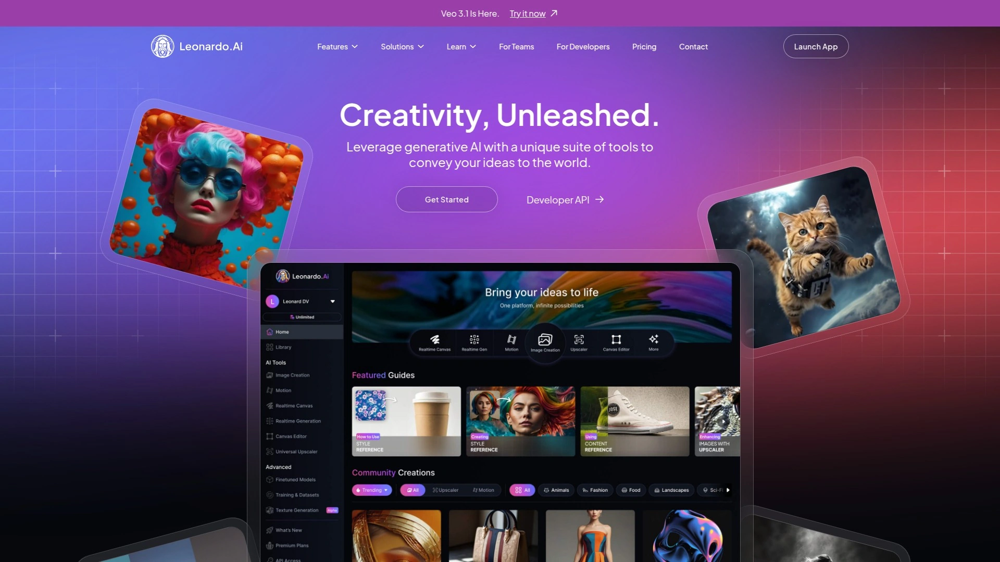
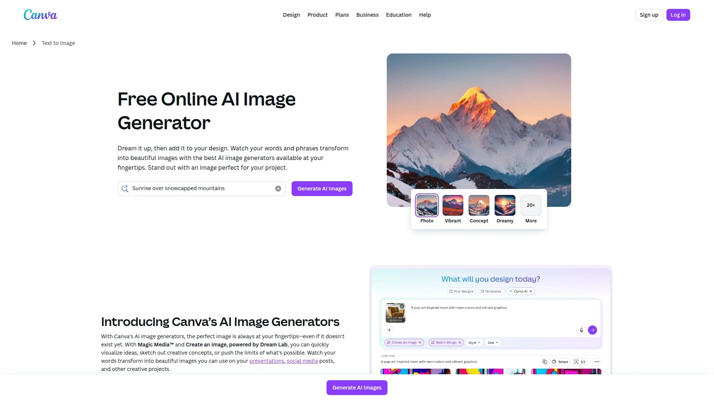
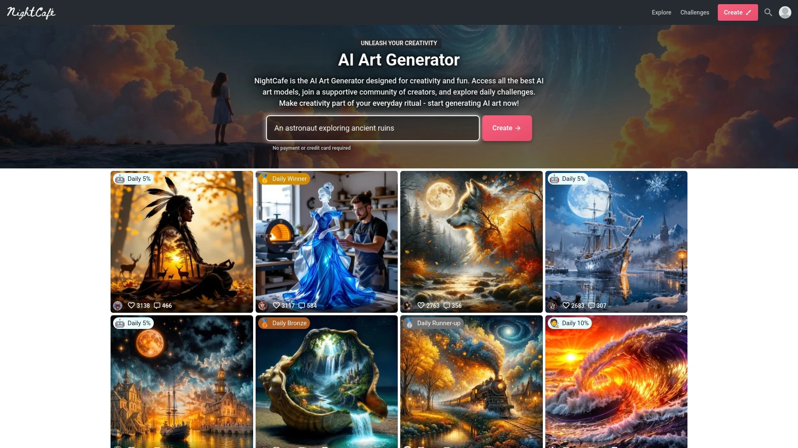
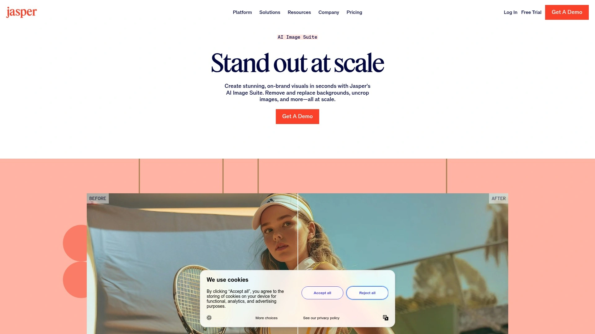
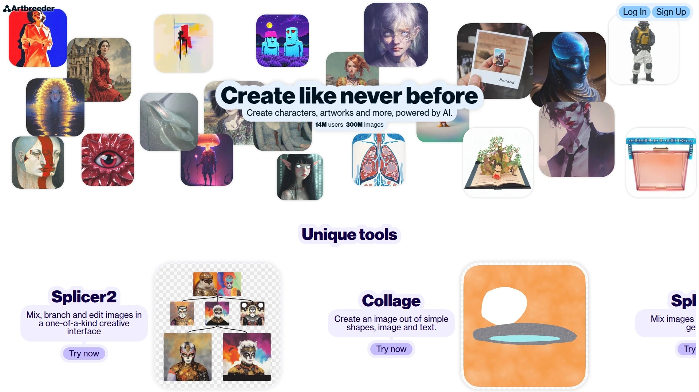
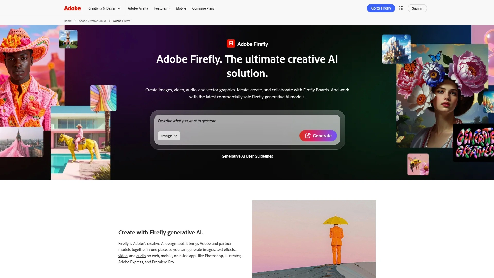

# Best 25+ AI Image Generation Platforms in 2025

Ever tried describing exactly what's in your head to a designer, only to get something that's close but not quite right? AI image generators solve that frustration by turning your text descriptions into visual reality in seconds. Whether you're creating social media graphics, concept art for projects, or just exploring creative ideas without needing design skills, these platforms let anyone transform words into images that actually match their vision.

## [Imagine.art](https://imagine.art)

A comprehensive AI creative suite combining image generation, video creation, and voice synthesis with photorealistic output and real-time rendering capabilities.

Imagine.art stands out through its ImagineArt 1.0 model, specifically designed to produce hyperrealistic images with exceptional detail in skin textures, fabric surfaces, and natural elements. The platform handles everything from human portraits to scenic landscapes and product visuals with nuanced lighting and natural movement. Real-time generation lets you type prompts and watch images evolve instantly, adjusting as your imagination develops.

Custom model training allows you to create consistent styles using your own reference images. The text-to-PNG feature generates transparent backgrounds perfect for logos, stickers, and banners in any size. Creative upscaling improves resolution and clarity while optionally adding artistic enhancements. Multiple AI models including Flux and Kling offer versatility across different visual styles from cartoon and sketch to comic and realistic rendering.

The Imagine Bot transforms simple descriptions into powerful prompts that generate better, more accurate results. Background removal preserves key subjects while eliminating distractions. Image restructuring modifies specific parts while maintaining the original composition. Over 30 million active users and 1 billion processed images demonstrate the platform's reliability and scale.

Free tier provides genuine functionality for experimentation, with paid plans unlocking additional features and higher generation limits. The interface balances simplicity for beginners with advanced controls for professional users.

## [Midjourney](https://www.midjourney.com)

A premium AI art generator renowned for producing highly detailed, artistic images with exceptional aesthetic quality accessed exclusively through Discord.

Midjourney excels at creating visually stunning artwork with artistic flair rather than pure photorealism. The Discord-based interface requires joining their server and using text commands to generate images, creating a unique community-driven experience. This approach may feel unfamiliar initially but provides powerful customization through parameter adjustments.

Version 6 introduced significant improvements in prompt adherence, ensuring generated images more accurately reflect detailed text descriptions. The platform handles complex compositions involving multiple subjects, intricate backgrounds, and specific artistic styles. Results consistently demonstrate high production value suitable for professional creative work.

Subscription starts at $10 monthly for approximately 200 images with commercial usage rights. Higher tiers provide faster generation speeds and private image creation. The community gallery showcases what's possible, serving as inspiration and a learning resource.

## [DALL-E 3](https://chatgpt.com)

OpenAI's latest image generator integrated directly into ChatGPT, offering conversational image creation and editing with strong prompt understanding.

DALL-E 3 distinguishes itself through conversational workflows where you can refine images through natural dialogue rather than rewriting entire prompts. The integration with ChatGPT Plus at $20 monthly provides unlimited access to both text generation and image creation in one subscription. This synergy allows you to brainstorm concepts, generate images, and iterate on designs without switching tools.

The model excels at understanding long, complex queries and translating nuanced descriptions into visual form. Safety features prevent generation of harmful content and respect copyright by refusing requests involving trademarked characters or living artists' styles. Editing capabilities let you modify specific regions of generated images by describing desired changes.

Free tier through Bing Image Creator provides limited DALL-E 3 access, though ChatGPT Plus unlocks full functionality. Image quality suits professional use cases including marketing materials, presentations, and creative projects.

## [Leonardo.AI](https://leonardo.ai)

A versatile AI art platform offering both free and paid options with consistent character generation and motion capabilities.

Leonardo.AI provides robust functionality on its free plan, making it accessible for creators testing AI image generation. The platform specializes in consistent character creation, letting you generate multiple images of the same character in different poses and scenarios. This consistency proves valuable for storytelling, game design, and brand mascot development.

Competitive generation speed delivers results quickly without sacrificing quality. Multiple AI models offer stylistic variety from photorealistic renders to anime and fantasy aesthetics. Canvas editor provides post-generation editing capabilities for refining details. Recent acquisition by Canva signals continued development and integration into broader creative workflows.

Motion features animate static images, creating short video clips that bring artwork to life. The platform balances ease of use with professional-grade output.

## [Canva AI Image Generator](https://www.canva.com/ai-image-generator/)

Canva's integrated AI image generation powered by multiple models including Leonardo, DALL-E, and Imagen, accessible within its design platform.

Canva democratizes AI image creation by embedding it directly into its popular design interface. Users already working on social media graphics, presentations, or marketing materials can generate images without leaving their project. This integration streamlines workflows by eliminating the need to switch between separate tools.

Magic Media feature lets you create images from text prompts or generate graphics and short videos. Style selection offers artistic, realistic, and conceptual options. Dream Lab, powered by the acquired Leonardo AI, provides 20 different style presets including cinematic and portrait modes. Generated images drop directly into your design canvas for immediate use.

Free accounts receive limited credits that refresh regularly. Canva Pro subscribers at $12.99 monthly gain substantially more generation capacity alongside Canva's full design toolkit. AI photo editing tools complement image generation, allowing background removal, object erasure, and style transfers.

## [NightCafe](https://creator.nightcafe.studio)

A comprehensive AI art platform aggregating multiple models including Flux, Stable Diffusion, DALL-E 3, and Imagen in one accessible interface.

NightCafe provides access to more AI models than any competing platform, letting you switch between engines to find the best fit for each project. Flux, Stable Diffusion, DALL-E 3, Google Imagen, Ideogram, and others all run through the same user interface. This variety ensures you can experiment with different approaches without managing multiple subscriptions.

VQGAN and CLIP work together to create art from text prompts through an iterative refinement process. Style transfer applies artistic aesthetics from reference images to your generations. Video models including LUMA Dream Machine and Stable Video Diffusion animate static artwork. The platform's community features let you share creations, join challenges, and discover trending styles.

Print services leverage AI upscaling to prepare your generated artwork for physical delivery. Free tier offers credits for daily generation, while paid subscriptions provide priority access and higher volumes. Copyright ownership transfers to creators for work they generate.

## [Jasper Art](https://www.jasper.ai/image-suite)

An AI image suite designed for marketing teams and enterprises, offering bulk background removal, image uncropping, and brand-consistent visual creation.

Jasper Art serves businesses needing to transform thousands of images quickly for product launches, seasonal campaigns, and content personalization. Bulk processing removes and replaces backgrounds across entire image libraries in seconds rather than hours. This automation eliminates the bottleneck images often create in marketing workflows.

Uncropping extends images to any size or aspect ratio by intelligently filling in missing areas. Upscaling increases resolution by up to 16 times while removing noise and recovering detail. Text removal scrubs unwanted typography from signage, documents, and apparel for content repurposing. These editing capabilities complement the image generation features powered by DALL-E 2.

Enterprise clients including Adidas, Ulta, and Wayfair use Jasper for retail campaigns. The platform emphasizes staying on-brand through style guidelines and templates. Pricing is custom-quoted based on team size and usage volume, positioning it firmly in the enterprise segment.

## [Artbreeder](https://www.artbreeder.com)

A collaborative AI art platform using machine learning to blend images and create photorealistic portraits through an intuitive slider-based interface.

Artbreeder enables unique creation methods by mixing multiple images together to generate new combinations. The Splicer feature lets you blend images while adjusting attributes through sliders that control age, skin tone, emotions, and other characteristics. This approach feels more like sculpting than traditional prompt-based generation.

Generative adversarial networks pit two neural networks against each other—one generates images while another judges their realism. This competition produces increasingly convincing results. The platform handles portrait creation particularly well, generating faces that don't exist but appear entirely real.

Collage creation combines shapes and images into cohesive compositions. Multi-scale transformations apply both global and local deformations to achieve desired results. Training on thousands of reference images enables the system to recognize and replicate patterns across diverse visual content. The collaborative nature encourages experimentation and remixing of community creations.

## [Adobe Firefly](https://www.adobe.com/products/firefly.html)

Adobe's enterprise-grade generative AI trained exclusively on licensed Adobe Stock content, integrated deeply into Creative Cloud applications.

Adobe Firefly prioritizes commercial safety by training only on Adobe Stock images and public domain content, eliminating copyright concerns. This ethical approach ensures generated images are safe for business use without legal risks. Native integration with Photoshop, Illustrator, and Express allows professionals to generate and edit AI content within familiar workflows.

Generative Fill intelligently adds or removes objects from images while maintaining realistic lighting and shadows. Text Effects creates stunning typography with textures and artistic
